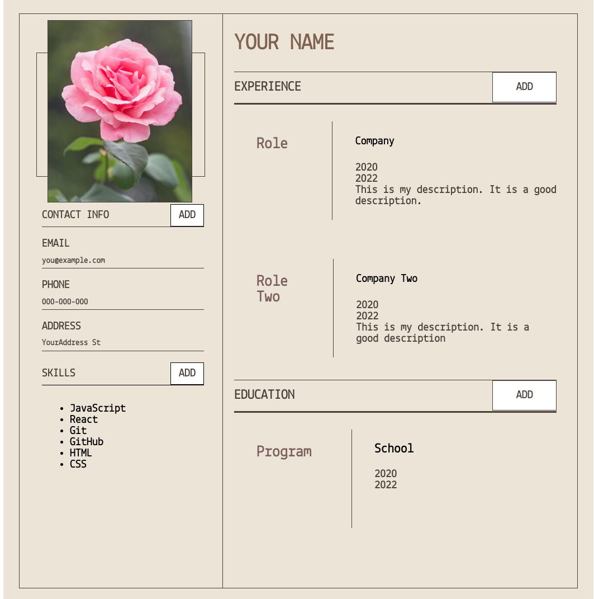

This is a CV application generator created using React. It is written using React classes, JavaScript, HTML and CSS.

How the page is structured: 

App.js: Contains the backbone of the code. All modules lead back to App.js. In it I declare the state, where I use nested objects and arrays. I also declare all event handlers, and pass them into other modules as props. I declared a separate event handler for each section, because each section was a little different from the other (the personal section required specific input types, the experience section required a description element, etc.). I saved state as a series of nested objects because I felt it was more intuitive that way. However, setState() does not work for nested objects out of the box, so I had to pass the state from one object layer to another within the event handlers. 

EducationForm.js/ExperienceForm.js: Contains the form layout & required inputs of each section. Each form takes the necessary props (onChange, onSubmit, object) and passes it onto my Input module, which will render the Input and send back the information as specified by these props. 

Input.js: This is my most used module, as I was able to change the type of information taken depending on where in the document it is called, due to a change in props. 

NewEducation.js/NewExperience.js: These are the files which dealt with rendering a new experience or education section when the form was submitted. In both I used .map on the array saved within each section in state, which contains a series of objects, and render each object separately. I initially tried using various arrays for each input, but the code was messier and much less intuitive, and I had trouble rendering the information in the format that I wanted. This format is repeated as well with the personal section & the skills section. 

Form change & submit pattern: 
1. onChange stores form changes into each object's input section. 
2. onSubmit stores that input inside the section's array
3. Object's input section is reset

How to Improve: I think App.js could have less code if I bundled the code I have, and there might be a way for me to re-use the form-rendering code, as well as the form-creating code instead of having separate modules for both of them since they are very similar. I might also have been able to only have one input section (instead of one per object) and just stored the value from the keys inside different arrays, whose keys would be specific to that section.  

